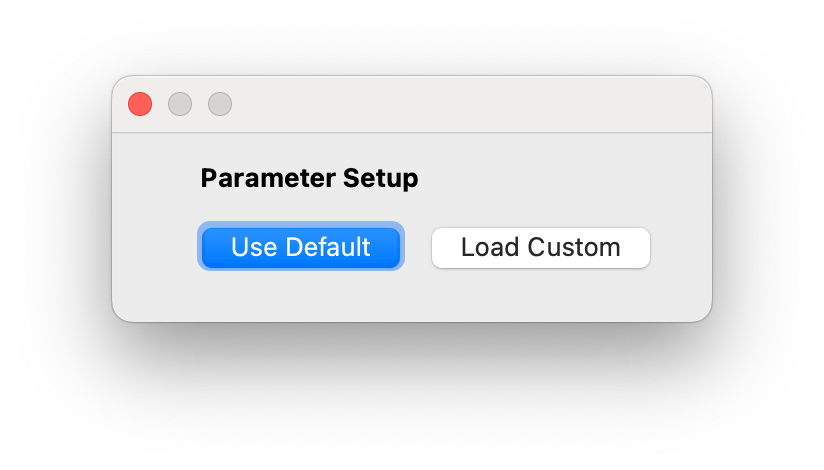
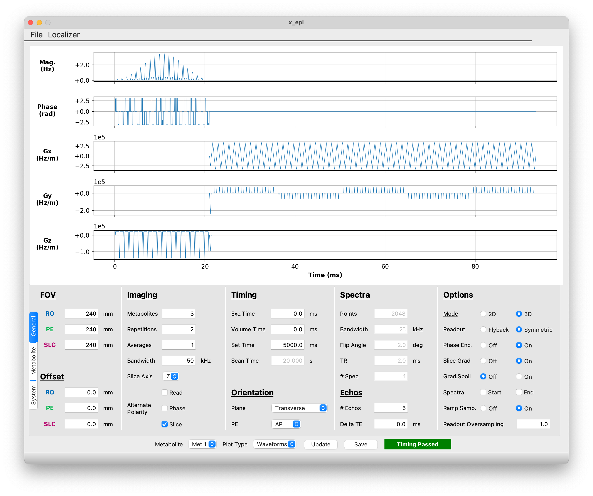
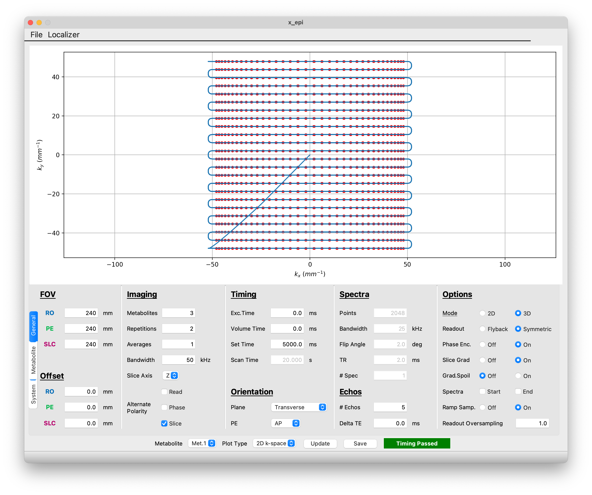
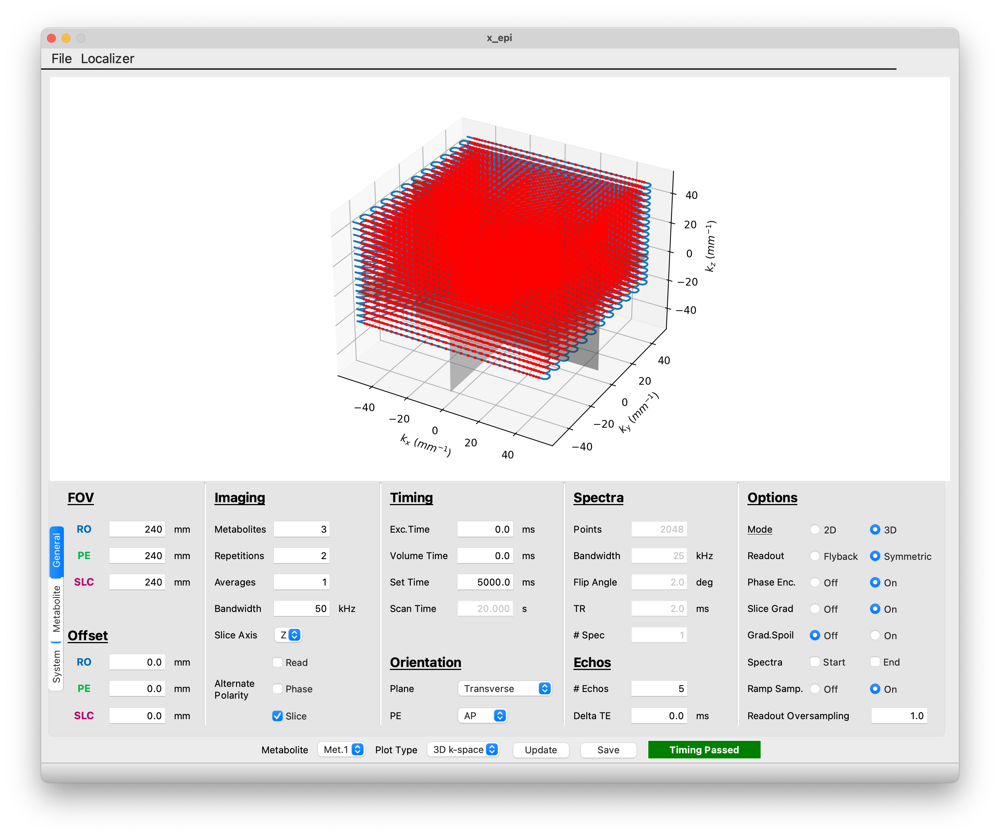
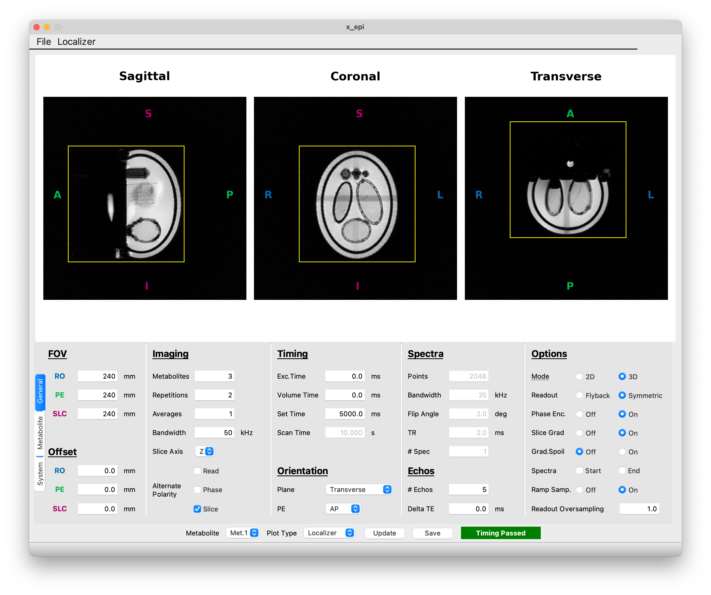
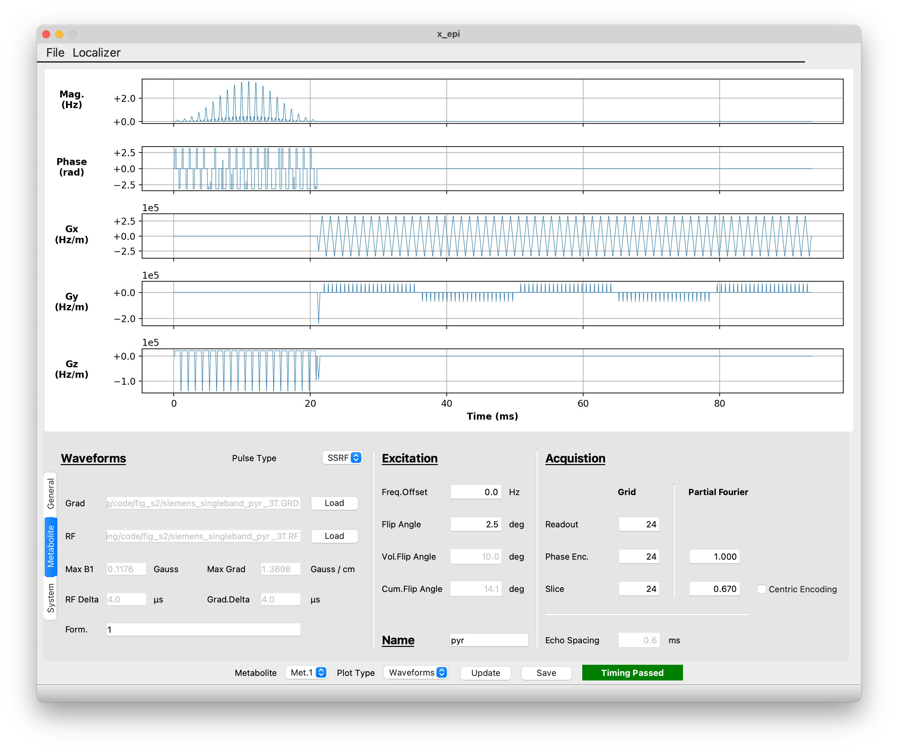
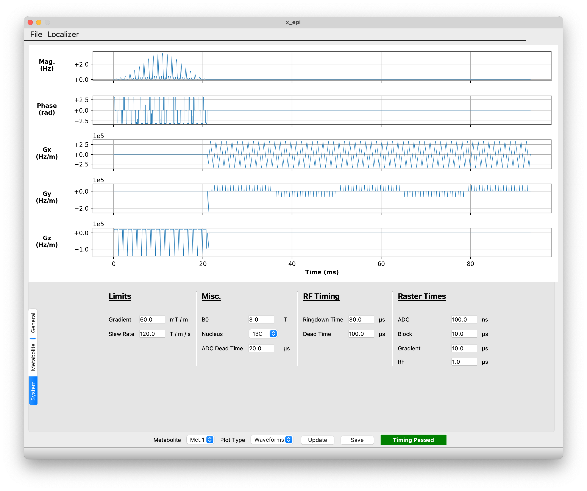

Graphical User Interface
########################

To launch the graphical user interface (GUI), simply type `x_epi_gui` in a command prompt.

This will launch a dialog box giving you the option of using the default sequence or
loading in a custom sequence. 

   
   Startup prompt for x_epi_gui
   
If you haven't already created a sequence using x_epi, than clicking 'Load Default'
is the best option. If you previously created a sequence, you can load it by clicking
'Load Custom' and selecting the JSON parameter file describing the sequence.

General Settings
----------------

The GUI consists of three separate tabs: General, Metabolite and System. From the General
tab, you can change a variety of parameters that are common to all metabolites. This 
includes the field-of-view, the number of metabolites, and the acquisition mode (2D or 3D).
You can have the option to include a spectra acquisition at the start and/or end of the
sequence. Note the the spectra acquisition won't appear on the waveform plot.
 

   The General settings tab
   
By default the interface shows the RF and gradient waveforms for the first metabolite.
You can switch between metabolites with the 'Metabolite' dropdown menu at the bottom of
GUI. You can also use the 'Plot Type' dropdown to selection select between the waveform
plot and 2D or 3D k-space plots. 

|2d_plot| |3d_plot|

You can also load a localizer to aid FOV setup by clicking 'Localizer' on the 
menu bar and selecting a directory containing the DICOM files for a standard SIEMENS
3-plane localizer. Other localizer sequences/platforms are not currently supported. 
Please note that the 'Orientation' dropdown has no effect on the waveforms/.SEQ file
generated by the GUI. You must change the orientation using the appropriate Pulseq
interpreter sequence on the scanner. The 'Orientation' dropdown is only included for
reconstruction purposes.

   Example of localizer view

Metabolite Settings
-------------------

Use can use the Metabolite tab to change metabolite specific parameters such as grid size
and flip angle. You also change change the RF pulse type from 
a spectral spatial radio frequency pulse (
`exported from the Spectral-Spatial RF Design Toolbox <https://github.com/LarsonLab/Spectral-Spatial-RF-Pulse-Design>`_
) or a standard SINC pulse. When using an SSRF pulse, you also have the option to specify
a formula for scaling the gradient amplitude to produce the desired slice thickness. 
For example, inputing x**2 will multiply the gradient amplitude in the SSRF gradient
file by the square of the slab/slice thickness (mm). This is useful for pulses where 
relationship between slice thickness/gradient ampltidue is nonlinear.

   The Metabolite settings tab
   
System Settings
---------------  
   
Finally, system-level parameters such as field strength and nucleus can be modified using
the system tab.

   The System settings tab 

Saving Sequences
-----------------

Once you have finished editing the sequence, you can preview it
using the 'Update' button or save it using the 'Save' button. Clicking 'Save' will
launch a file save dialog allowing you to specify the output location. Three files will 
be produced:

#. <output_name>.seq: This is the Pulseq sequence file that can be uploaded to the scanner and run using the interpreter sequence.
#. <output_name>.json: Parameter file describing the sequence. This file can be loaded into x_epi_gui for viewing and/or modification.
#. <output_name>_kspace.npy: A Numpy array object containing the k-space data for each metabolite.
