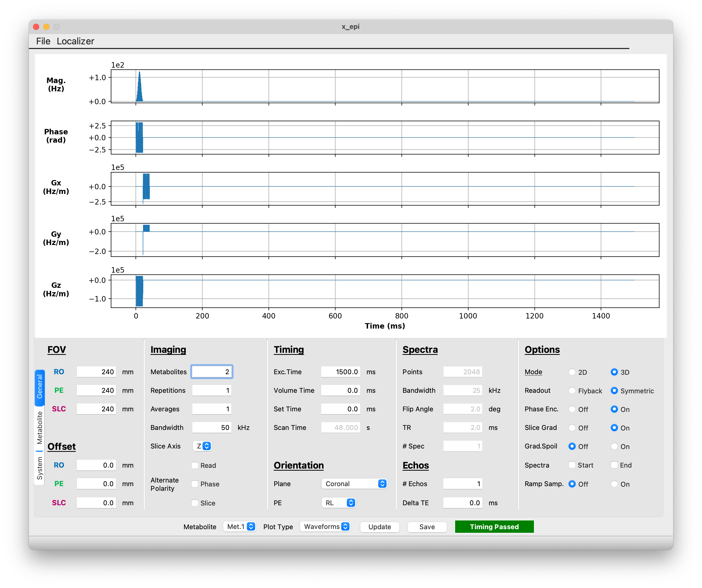
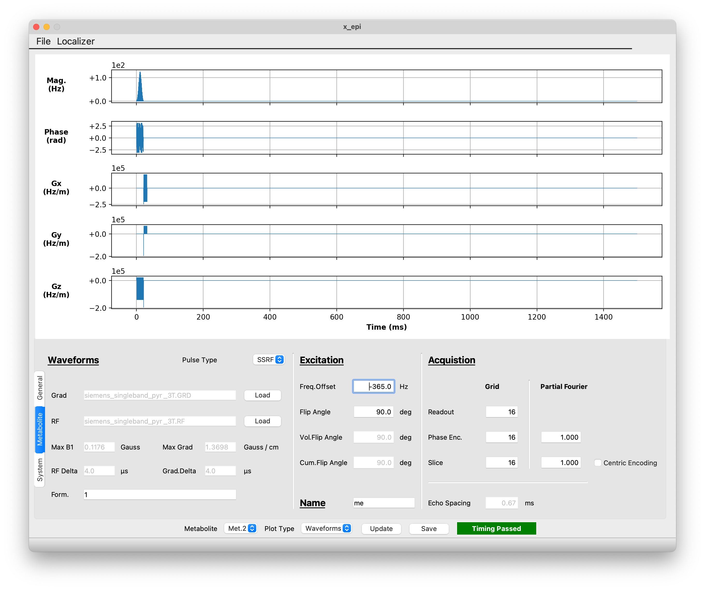
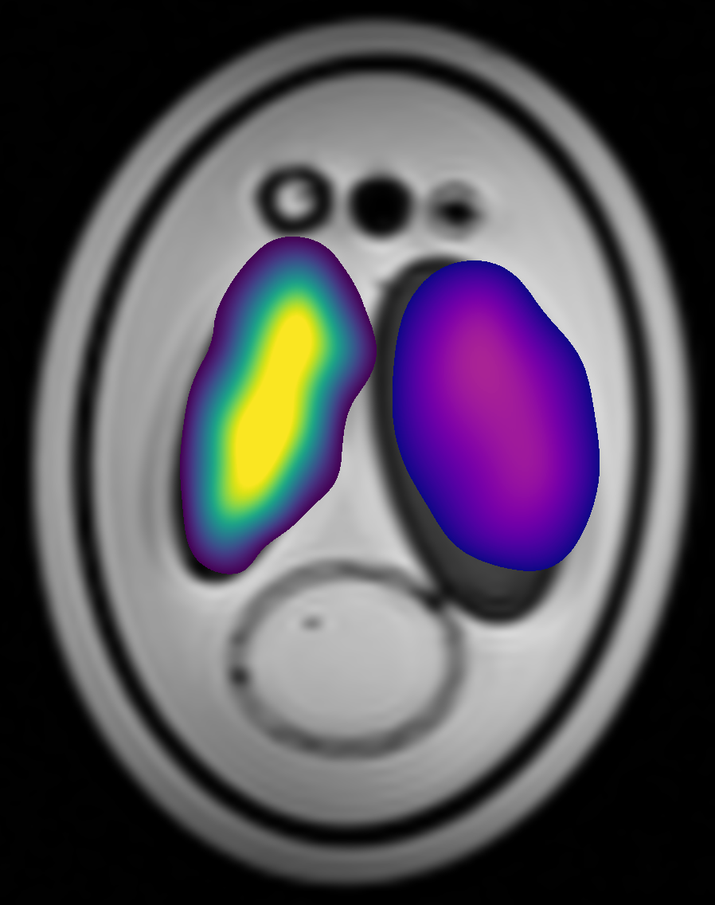

Tutorial
########

The purpose of this tutorial is to show new users how to get started with **x_epi**. In
the first part of the tutorial, we will show how you can use **x_epi** to create the 
sequence  used in Figure 2 of the upcoming paper. Then in the second part of the tutorial 
we will show how you can use **x_epi** to reconstruct the data acquired using the
sequence created in part one.

Sequence Creation
-----------------

For this tutorial, we will use the :doc:`GUI <seq_doc/ui>` to create the sequence. To
launch the GUI, type `x_epi_gui` in a command prompt and click 'Use Default' in the prompt
that comes up. This will load the default sequence, which is a multi-echo 3D symmetric EPI
sequence with three different metabolites.

General Settings
^^^^^^^^^^^^^^^^

As the sequence used in the paper is a single-echo 3D symmetric EPI sequence with only two
metabolites, a few changes will have to be made to the default sequence. In the 'General'
tab, make the following changes:

#. Change the metabolite field from 3 to 2
#. Reduce the number of repetitions from 2 to 1
#. Uncheck the Alternate Polarity: Slice button
#. Under timing change Exc. Time to 1500 and Set Time to 0
#. Change the Orientation to Coronal
#. Reduce the number of echoes form 5 to 1
#. Under options, switch Ramp Samp. from On to Off. 

   Changes in the General settings 

Metabolite Settings
^^^^^^^^^^^^^^^^^^^

You will need to make specific changes for each of the two metabolites that will be
acquired. To do this, first click on the 'Metabolite' tab. This will show the current
settings for the first metabolite. To match the paper sequence, you will need to make the 
these changes:

#. Increase the flip angle to 90 degrees.
#. Change the metabolite name from 'pyr' to 'eg' for ethylene glycol
#. Reduce the partial Fourier fraction in the 'slice' direction to 0.66

To change the settings for the second metabolite, you will need to select 'Met 2' in the
Metabolite dropdown at the bottom of the screen. Then you can make the following changes:

#. Add a frequency offset of -365 Hz
#. Increase the flip angle to 90 degrees 
#. Change the metabolite name from 'lac' to 'me' for methanol
#. Decrease the acquisition grid from 20x20x20 to 16x16x16
#. Turn off Partial Fourier in the second phase encoding direction by changing the 'slice' partial Fourier fraction to 1

   Changes for the second metabolite

Output
^^^^^^

Once all the necessary changes have been made, you can save the sequence by clicking the
'Save' button. For the purposes of this tutorial, we will save the sequence as
'x_epi_tutorial'. As discussed in the :doc:`GUI documentation <seq_doc/ui>` this will
produce three difference files. The 'x_epi_tutorial.seq' file is the  file that will
be taken to the scanner and run. If you do plan to test the sequence on your scanner,
make sure to switch the image orientation to 'Coronal' in the interpreter sequence. If
you don't do this, the reconstructed image will not have the correct orientation. The
sequence parameters are listed in 'x_epi_tutorial.json'. This file can be loaded into
the GUI for future editing, and is needed to reconstruct the data.

Reference Scan
^^^^^^^^^^^^^^

.. |1H| replace:: :sup:`1`\ H

Because symmetric EPI sequences are sensitive to gradient delays between odd and even
k-space lines, it is often useful to acquire a reference scan with no phase encoding
gradients. You can create a sequence for collecting a reference scan by changing the
'Phase Enc' in the General tab to 'Off'. For the paper, we also changed the flip angle
to 45 degrees and frequency offset to 0 Hz for each metabolite. This was done because
we acquired the reference scan on the |1H| channel.

Once you have made the necessary changes, save the sequence as 'x_epi_tutorial_ref' 

Image Reconstruction
--------------------

.. |13C| replace:: :sup:`13`\ C

Once you have acquired data using the a **x_epi** sequence, you can reconstruct it using
the `x_epi_recon` command line program. You can find an example |13C| MRI dataset 
acquired using the sequence above at our `Github <https://github.com/tblazey/x_epi/>`_.
This dataset was acquired using a 
`3D printed Shepp Logan metabolite phantom <https://pubmed.ncbi.nlm.nih.gov/25644140/>`_ 
containing ethylene glycol (left chamber) and methanol (right chamber). Once you have
downloaded the datafile 'raw.dat' you can reconstruct it with the following command:

.. code-block:: bash

    x_epi_recon raw.dat tutorial.json recon -n_avg 32

The second argument is the JSON file describing the sequence used to acquired the data,
and the third is the root for each output file. The command will produce a
`NIfTI <https://nifti.nimh.nih.gov/>`_ image for each metabolite. In this case the output
name for each image will be recon_<met_name> where <met_name> is the name given to the
metabolite when the sequence was created. The -n_avg 32 flag is added because 32 averages
were acquired at the scanner. 

If you have a higher resolution structural image, you can pass it with the -anat
argument:

.. code-block:: bash

    x_epi_recon raw.dat tutorial.json recon -n_avg 32 -anat anat.nii.gz

This will create `FSL <https://fsl.fmrib.ox.ac.uk/fsl/fslwiki>`_ style transformation
matrices between each metabolite and the anatomical image using the NIfTI headers.

Finally, you can add in the reference scan data, raw_ref.dat, to account for odd/even
timing differences:

.. code-block:: bash

    x_epi_recon raw.dat tutorial.json recon -n_avg 32 -anat anat.nii.gz -ref raw_ref.dat tutorial_ref.json

The image below shows the output from the recon using a reference scan.
The ethylene glycol metabolite image is shown in purple/green/yellow and the methanol
image is in purple/orange/yellow. Under both images is a T1-weighted structural image.
As expected, the |13C| metabolite signal from each metabolite is confined to a single
chamber. For more advanced reconstruction options, including
`POCS  <https://www.sciencedirect.com/science/article/abs/pii/002223649190253P>`_ and 
field-map based distortion correction, see the paper and the 
`Github <https://github.com/tblazey/x_epi/>`_.

   Reconstructed |13C| metabolite images

